# Study English App 📚

Ứng dụng học tiếng Anh đơn giản giúp luyện từ vựng, ngữ pháp và bài tập tương tác trên di động.

## 🚀 Tính năng chính

- Học từ vựng với bộ flashcard  
- Làm bài tập tương tác và kiểm tra kiến thức  
- Theo dõi tiến độ học tập  
- Giao diện thân thiện, dễ dùng trên nhiều kích thước màn hình

## 🛠️ Công nghệ sử dụng

- **Flutter** (Dart) — UI & logic ứng dụng  
- **Provider / Bloc** — Quản lý trạng thái  
- **Firebase** (tuỳ chọn): Auth, Firestore
- **Git / GitHub** — Quản lý phiên bản mã nguồn

## ⚙️ Cài đặt & sử dụng

1. Clone repo:
    ```bash
    git clone https://github.com/huyetdao431/study_english_app.git
    ```
2. Vào thư mục dự án:
    ```bash
    cd study_english_app
    ```
3. Cài đặt dependency:
    ```bash
    flutter pub get
    ```
4. Chạy ứng dụng:
    ```bash
    flutter run
    ```

> **Lưu ý**: cần cài đặt Flutter SDK (>= phiên bản project sử dụng).

## 📋 Yêu cầu hệ thống

- Flutter SDK (khoảng v3.x trở lên)  
- Dart (v2.x tương ứng với Flutter)  
- Android Studio hoặc Xcode (tuỳ nền tảng)  

## 🧭 Hướng phát triển tiếp theo (Tuỳ chọn)

- Lưu điểm học tập cá nhân trên Firestore  
- Thêm chế độ học ngoại tuyến  
- Cải thiện giao diện, theme

## 👤 Tác giả

- **HoangHieu133** — [GitHub Profile](https://github.com/huyetdao431)  
- Email: hoangvanhieu133@gmail.com

## 📱 Demo ứng dụng

### 🔹 Video demo
👉 [Xem video demo tại đây](https://youtu.be/NWgOQN10ePY?si=5a4qdUdeeex8OOyI) 

## 📱 Giao diện màn hình ứng dụng

### 🏠 Màn hình chính
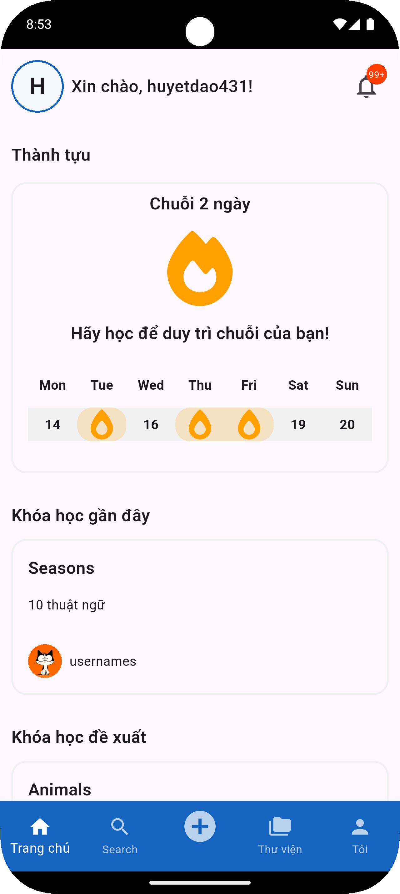

### 🔍 Màn hình tìm kiếm
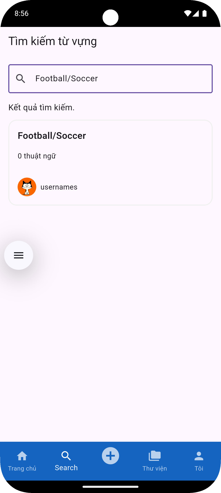

### 📚 Màn hình thư viện khóa học
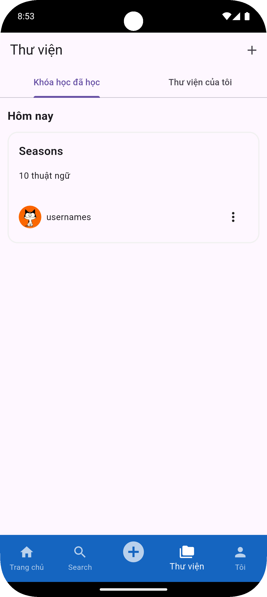

### 🧠 Màn hình flashcard học từ
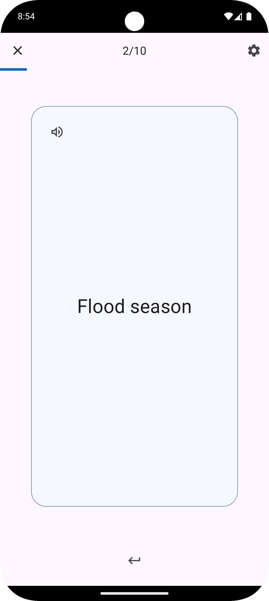

### 📝 Màn hình làm bài kiểm tra
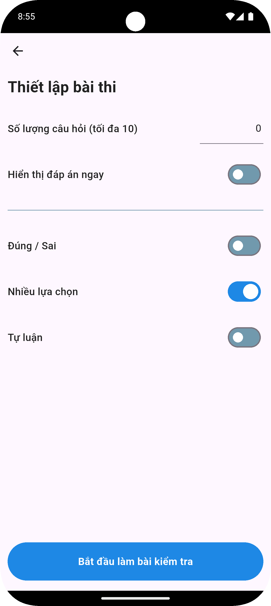

### 🧩 Màn hình trò chơi nhỏ (mini-game)
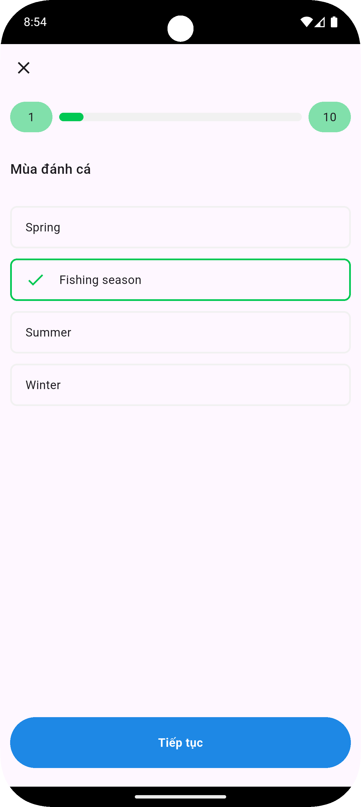

### ✅ Màn hình kết quả bài học
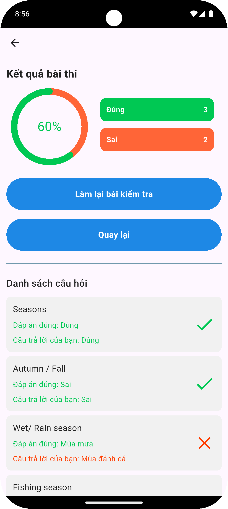

### ➕ Màn hình thêm khóa học
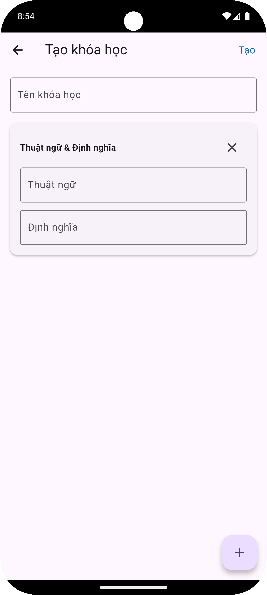

### ✏️ Màn hình chỉnh sửa ghép thẻ
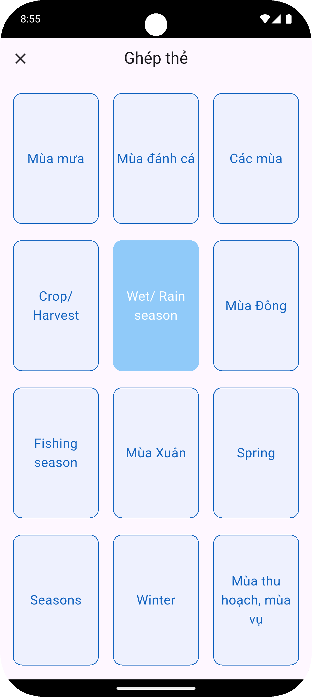

### 📖 Màn hình chi tiết khóa học
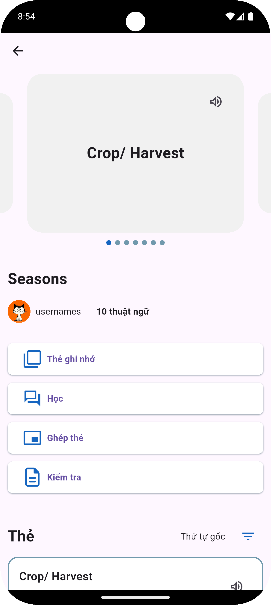

### 👤 Màn hình tài khoản
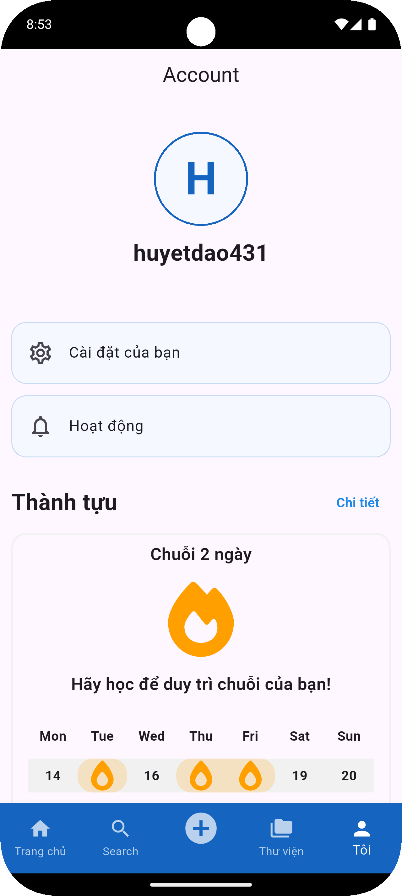

### ⚙️ Màn hình cài đặt tài khoản
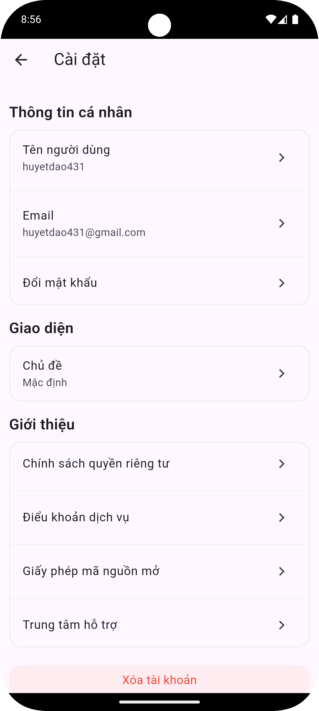

### 🔐 Màn hình đăng nhập
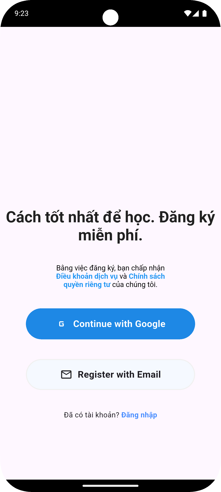

### 🆕 Màn hình đăng ký
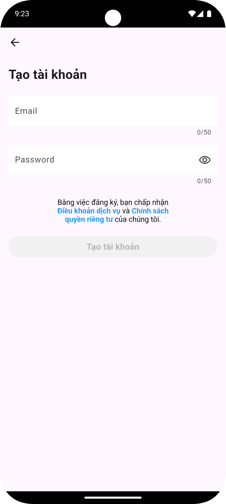


